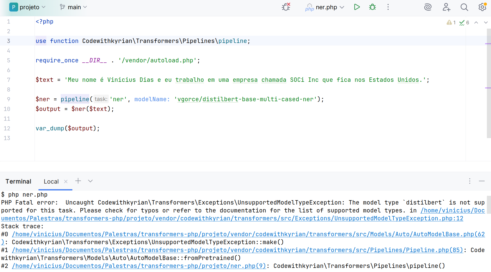

<style>
    p:has(img) {
        text-align: center;
    }
</style>

# TransformersPHP
## Executando modelos pré-treinados de IA

---

<style scoped>
    p:has(img) {
        display: flex;
        align-items: center;
        gap: .2rem;
        margin-bottom: 0;
    }
</style>

# Quem é Vinicius Dias?

- Especialista em Arquitetura de Software
- Senior Software Engineer na SOCi
- Instrutor na Alura
- Canal Dias de Dev no YouTube

## Links
 @cviniciussdias

https://dias.dev/
https://youtube.com/@DiasDeDev

---

# Dê feedback

Nenhuma apresentação é perfeita e nós que criamos conteúdo sabemos disso.
Nossa intenção é transmitir conhecimento da melhor forma possível e sua opinião é muito importante para isso.


---

# O que é IA

Resposta gerada por IA:

> É a área da computação que busca criar sistemas capazes de executar tarefas que normalmente exigiriam inteligência humana, como raciocinar, aprender, tomar decisões, reconhecer padrões, entender linguagem e até criar conteúdos.

---

# O que é IA

- Machine Learning
- Processamento de linguagem natural
- Visão computacional
- Robótica
- Etc

---

# Exemplos de aplicação

- Transcrição de áudio
- Tradução de texto
- Recomendação de conteúdo

---

# IA com PHP


---

# Transformers


---

# Transformers

Tipo de arquitetura de redes neurais criada para processamento de dados sequenciais, usada em diversos sistemas modernos de IA.

---

# TransformersPHP

> State-of-the-art Machine Learning for PHP. Run Transformers natively in your PHP projects

---

# TransformersPHP

## Pré-requisitos

- PHP 8.1+
- Composer
- Extensão FFI
- JIT (opcional, para performance)
- Limite de memória aumentado

---

# TransformersPHP

<!-- Durante a instalação um plugin trará as bibliotecas do sistema para a execução dos modelos -->

## Instalação

```shell
$ composer require codewithkyrian/transformers
```

---

# Resumindo textos com TransformersPHP

```php
<?php

use function Codewithkyrian\Transformers\Pipelines\pipeline;

require_once __DIR__ . '/vendor/autoload.php';

$resumidor = pipeline('summarization');
$textoGrande = '...';
$resumo = $resumidor($textoGrande, maxNewTokens: 100);

var_dump($resumo);

```

---

# Mais tarefas com texto

- Análise de sentimento
- Resposta de perguntas
- Tradução
- Geração de texto
- Etc.

---

# Modelos diferentes para mesma tarefa

## Análise de sentimento

```php
<?php

$analisador = pipeline(
    'sentiment-analysis',
    modelName: 'Xenova/bert-base-multilingual-uncased-sentiment'
);
$positivo = $analisador('I love PHP!');
$negativo = $analisador('I hate JavaScript!');

var_dump($positivo, $negativo);

```

---

# Além do texto

## Lidando com imagens

```php
use Codewithkyrian\Transformers\Utils\ImageDriver;
use Codewithkyrian\Transformers\Transformers;

Transformers::setup()
    ->setImageDriver(ImageDriver::VIPS);
$tarefa = pipeline('image-to-text');
$resultado = $tarefa('imagem.jpg');
```

---

# Drivers de imagem

- Imagick
- GD
- VIPS

---

# Encontrando modelos

## Hugging Face


---

# Filtros

- Transformers.js
- ONNX

---

# Limitações

## Número reduzido de modelos que atendem o filtro

---

# Tarefa de NER em Português


---

# Tarefa de NER em Português



---

# Solução

## Converter modelos para ONNX

---

# Converter modelos para ONNX

- tf2onnx
- Script convert.py do Transformers.js
- Um pouco de Python e ajuda de LLMs

---

# Converter modelos para ONNX

- tf2onnx
- Script convert.py do Transformers.js
- **Um pouco de Python e ajuda de LLMs**

---

# Tarefa de NER em Português

```php
<?php

$ner = pipeline(
    'ner',
    modelName: 'cviniciussdias/wikineural-multilingual-ner',
    quantized: false
);
$output = $ner('...');

var_dump($output);
```

---

# Limitação

## Pipelines não podem fazer tudo por nós

---

# O que é uma pipeline?

Um conjunto de instruções para:

1. Pré-processar a entrada
2. Executar o modelo
3. Pós-processar a saída

---

# Solução

## AutoProcessor + AutoModel + Bom e velho PHP

---

# Modelos não suportados

## AutoProcessor

```php
$processor = AutoProcessor::fromPretrained('briaai/RMBG-2.0');
```

---

# Modelos não suportados

## AutoModel

```php
$model = AutoModel::fromPretrained('briaai/RMBG-2.0');
```

---

# Modelos não suportados

## Juntando as partes

```php
$image = Image::read(__DIR__ . '/eu.jpg');
$saida = $model($processor($image));
```

---

# Modelos não suportados

## Saída do modelo + TransformersPHP = <3

---

# Removendo fundo da imagem

```php
['alphas' => $outputPixels] = $saida;
$whitePixels = $outputPixels[0]->multiply(255);
$mask = Image::fromTensor($whitePixels)
	->resize($image->width(), $image->height());

$maskedImage = $image->applyMask($mask);
$maskedImage->save(__DIR__ . '/transparente.png');
```

---

# Quando usar?

Ferramenta ainda instável, com bugs e performance aquém do ideal.

Use com sabedoria

---

# Outras ferramentas de IA para PHP

- [RubixML](https://rubixml.github.io/ML)
- [FANN](https://www.php.net/manual/en/book.fann.php)
- [Whisper.PHP](https://github.com/CodeWithKyrian/whisper.php)
- [ONNX Runtime](https://github.com/ankane/onnxruntime-php)
- [ORT (Oh Really, Tensors?)](https://github.com/krakjoe/ort)

---

# Obrigado


