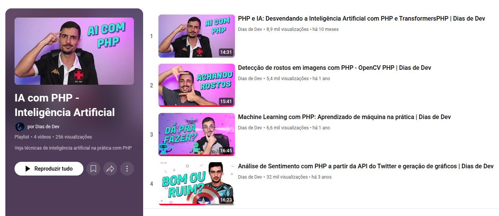
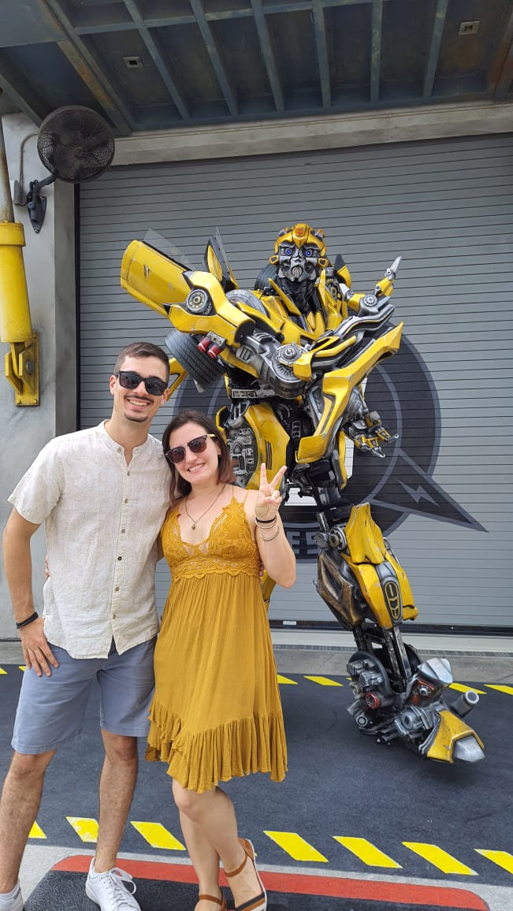
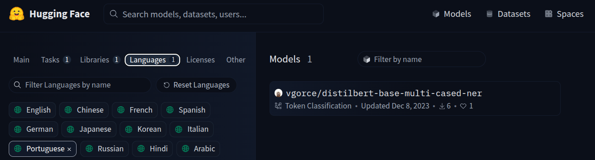
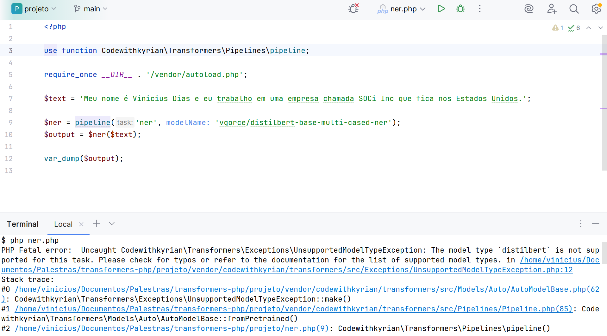

<style>
    p:has(img) {
        text-align: center;
    }
</style>

# TransformersPHP
## Executing pretrained AI models with PHP

<!--
---

<style scoped>
    p:has(img) {
        display: flex;
        align-items: center;
        gap: .2rem;
        margin-bottom: 0;
    }
</style>

# Quem é Vinicius Dias?

- Especialista em Arquitetura de Software
- Senior Software Engineer na SOCi
- Instrutor na Alura
- Canal Dias de Dev no YouTube

## Links
 @cviniciussdias

https://dias.dev/
https://youtube.com/@DiasDeDev

---

# Dê feedback

Nenhuma apresentação é perfeita e nós que criamos conteúdo sabemos disso.
Nossa intenção é transmitir conhecimento da melhor forma possível e sua opinião é muito importante para isso.


-->
---

# What is AI

Response generated by AI:

> AI (Artificial Intelligence) is the simulation of human intelligence by machines, enabling them to perform tasks like learning, reasoning, and problem-solving.

---

# What is AI

- Machine Learning
- Natural Language Processing
- Computer Vision
- Robotics
- Etc

---

# Examples of when to use it

- Audio transcription
- Text translation
- Recommendation systems

---

# (Portuguese) IA com PHP



---

# Transformers



---

# Transformers

Transformers are a type of deep learning model architecture designed to process sequential data using self-attention mechanisms, and they power many modern AI systems.

---

# TransformersPHP

> State-of-the-art Machine Learning for PHP. Run Transformers natively in your PHP projects

---

# TransformersPHP

## Prerequisites

- PHP 8.1+
- Composer
- FFI Extension
- JIT (optional, for performance)
- Increased memory limit

---

# TransformersPHP

<!-- Durante a instalação um plugin trará as bibliotecas do sistema para a execução dos modelos -->

## Installation

```shell
$ composer require codewithkyrian/transformers
```

---

# Text summarization with TransformersPHP

```php
<?php

use function Codewithkyrian\Transformers\Pipelines\pipeline;

require_once __DIR__ . '/vendor/autoload.php';

$summarizer = pipeline('summarization');
$bigText = '...';
$summary = $summarizer($bigText, maxNewTokens: 100);

var_dump($summary);

```

---

# More NLP Tasks

- Sentiment Analysis
- Question Answering
- Translation
- Text Generation
- Etc

---

# Different models for the same task

## Sentiment analysis

```php
<?php

$analyser = pipeline(
    'sentiment-analysis',
    modelName: 'Xenova/bert-base-multilingual-uncased-sentiment'
);
$positive = $analyser('I love PHP!');
$negative = $analyser('I hate JavaScript!');

var_dump($positive, $negative);

```

---

# Beyond text

## Dealing with Images

```php
use Codewithkyrian\Transformers\Utils\ImageDriver;
use Codewithkyrian\Transformers\Transformers;

Transformers::setup()
    ->setImageDriver(ImageDriver::VIPS);
$task = pipeline('image-to-text');
$result = $task('image.jpg');
```

---

# Image Drivers

- Imagick
- GD
- VIPS

---

# Finding AI Models

## Hugging Face


---

# Filters

- Transformers.js
- ONNX

---

# Limitation

## Reduced number of models with that filter

---

# NER task in Portuguese



---

# NER task in Portuguese



---

# Solution

## Converting models to ONNX

---

# Converting models to ONNX

- tf2onnx
- Transformers.js convert script
- Some Python + LLM Help

---

# Converting models to ONNX

- tf2onnx
- Transformers.js convert script
- **Some Python + LLM Help**

---

# NER task in Portuguese

```php
<?php

$ner = pipeline(
    'ner',
    modelName: 'cviniciussdias/wikineural-multilingual-ner',
    quantized: false
);
$output = $ner('...');

var_dump($output);
```

---

# Limitation

## Pipelines can't do everything for us

---

# What is a pipeline?

A set of instructions for:

1. Pre-processing the input (tokenizer / processor)
2. Executing the model
3. Post-processing the output

---

# Solution

## AutoProcessor + AutoModel + Good old PHP

---

# Not supported AI Models

## AutoProcessor

```php
$processor = AutoProcessor::fromPretrained('briaai/RMBG-2.0');
```

---

# Not supported AI Models

## AutoModel

```php
$model = AutoModel::fromPretrained('briaai/RMBG-2.0');
```

---

# Not supported AI Models

## Putting the pieces together

```php
$image = Image::read(__DIR__ . '/eu.jpg');
$output = $model($processor($image));
```

---

# Not supported AI Models

## Model output + TransformersPHP = <3

---

# Removing image's Background

```php
['alphas' => $alphas] = $output;
$alphaMaskTensor = $alphas[0]->multiply(255);
$mask = Image::fromTensor($alphaMaskTensor)
	->resize($image->width(), $image->height());

$maskedImage = $image->applyMask($mask);
$maskedImage->save(__DIR__ . '/transparente.png');
```

---

# When to use?

Still unstable, and has room for performance improvements.

Use with caution.

---

# Thank you


